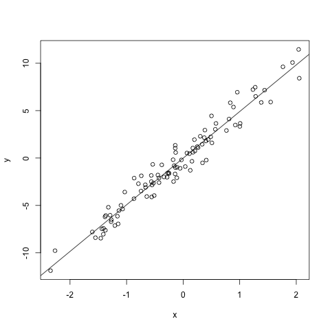

# Project details

This project is an example of how one might set up a project in R. The benefits of always organising projects the same way and in a modular fashion are:

- Integrity of data
- Portability of the project
- Easier to pick the project back up after a break

If you use `git`, this `README.md` file will be the first thing people see on your Github page. So, get in the habit of using one in your project's root directory/folder.

### A list of project tasks to-do:

- This
- That
- And this again

### Perhaps display some data or a result.

